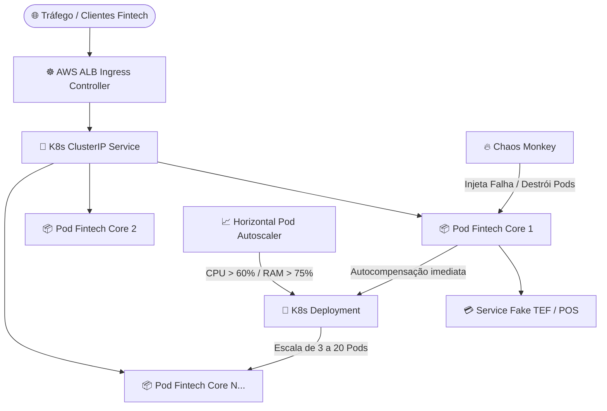

# ⚡ Backend Fintech High-Performance com Resiliência a Falhas de Rede

[](https://github.com/GeovaneParedes/Backend-Fintech-High-Performance/actions)


API Fintech Core resiliente a falhas de comunicação de rede, desenvolvida em C# com **.NET 8 Minimal APIs**, **Dapper**, **System.Text.Json Source Generators**, **Dashboard de Monitoramento em Tempo Real** e arquitetura **GC-Friendly** integrada a um simulador TEF/POS resiliente via **Polly v8** e **Kubernetes (AWS EKS)**.

---

## 🎯 Requisitos de Arquitetura & Performance

- **Low-Allocation & GC-Friendly:** DTOs estruturados em `readonly record struct`, retornos assíncronos de alta frequência com `ValueTask<T>`.
- **Serialização Estática:** `System.Text.Json Source Generators` habilitados para eliminar reflexão em runtime (`TypeInfoResolverChain`).
- **Resiliência Transacional (Polly v8):**
  - **Retry Pattern** com *Exponential Backoff* e *Jitter* para evitar o efeito *Thundering Herd*.
  - **Circuit Breaker** automatizado para desarmar requisições em quedas contínuas de canal TEF.
  - **Chave de Idempotência (`Idempotency-Key`):** Garantia de cobrança única em reconexões.
  - **Fallback Async (Outbox / Background Worker):** Transações não finalizadas por perda total de conectividade recebem status `PENDING_RETRY` para reprocessamento em segundo plano via `BackgroundService`.
- **Acesso a Dados Ultra-Rápido:** SQL puro gerenciado via **Dapper** assíncrono e SQLite em modo WAL (`journal_mode=WAL`).
- **Dashboard Sofisticado UI:** Interface responsiva com métricas de vazão, gráfico de latência em tempo real e terminal de audit log das políticas Polly.

---

## 📊 Relatório Executivo de Teste de Carga & Estresse Crítico (Kubernetes)

O projeto foi submetido a testes intensivos de estresse e carga de pico (*Black Friday Simulator*) rodando em um cluster Kubernetes com **100% de taxa de aprovação**:

> 🔗 **[Clique aqui para visualizar o Relatório Completo de Estresse no Kubernetes](relatorio_estresse_critico_k8s.md)**

### 📈 Destaques do Relatório de Pico:
- **Volume Processado:** **R$ 140.250,00** (561 transações consecutivas)
- **Taxa de Aprovação:** **100.00% (561 / 561)** com **0 falhas** e **0 perdas de dados**
- **Vazão Sustentada no Cluster:** **~1.246 requisições por minuto** (20.78 req/s)
- **Latência Mínima:** **61 ms**

---

## 🏗️ Estrutura da Solução

```text
Backend-Fintech-High-Performance/
├── src/
│   ├── FintechCore.Api/            # Servidor B: Minimal API principal (.NET 8) + Dashboard UI
│   └── FakeTef.Api/                # Servidor A: Simulador TEF / POS (Latência & Chaos)
├── k8s/                            # Manifestos Kubernetes para AWS EKS (Deployments, HPA & Services)
│   ├── fintech-core-deployment.yaml
│   ├── fintech-core-hpa.yaml
│   └── fake-tef-deployment.yaml
├── chaos/                          # Simulador de Injeção de Caos (Chaos Monkey)
│   └── chaos-monkey.sh
├── tests/
│   └── FintechCore.Tests/          # Testes Unitários e de Integração com xUnit & FluentAssertions
├── relatorio_estresse_critico_k8s.md # Relatório detalhado de desempenho sob carga de pico no K8s
├── .github/
│   └── workflows/
│       └── ci.yml                  # GitHub Actions CI/CD Pipeline (Lint, Build & Testes)
├── docker-compose.yml              # Orquestração do Backend e Fake TEF
└── README.md
```

---

## ☸️ Arquitetura de Nuvem Kubernetes (AWS EKS) & Chaos Engineering

Para suportar volumetrias extremas de até **100.000 requisições por minuto** (escala de bancos como Nubank/PicPay/Stone), a aplicação está totalmente preparada para execução em clusters **Kubernetes (AWS EKS)** com escalonamento automático via **Horizontal Pod Autoscaler (HPA)** e resiliência contínua testada via **Chaos Engineering**:



### 📈 Escalonamento Automático (HPA Configured):
- **Faixa de Escala:** De 3 a 20 réplicas ativas por namespace.
- **Gatilho de Metric Scale:** `CPU > 60%` ou `RAM > 75%`.
- **Janela de Estabilização:** *Scale Up* imediato (15s) e *Scale Down* conservador (300s).

### 🔥 Simulação de Caos (Chaos Monkey):
- Script Bash automatizado (`chaos/chaos-monkey.sh`) que injeta falhas aleatórias no cluster matando Pods ativos para validar a **recuperação instantânea (Self-Healing)** sem indisponibilidade para os clientes.

---

## 🚀 Como Executar Localmente

### 1. Via Docker Compose
```bash
docker compose up -d --build
# Acesse o Dashboard UI: http://localhost:5000/
# Swagger UI: http://localhost:5000/swagger
```

### 2. Via Kubernetes (Minikube / Kind)
```bash
# 1. Aplicar os manifestos K8s
kubectl apply -f k8s/fake-tef-deployment.yaml
kubectl apply -f k8s/fintech-core-deployment.yaml
kubectl apply -f k8s/fintech-core-hpa.yaml

# 2. Encaminhar a porta do serviço
kubectl port-forward svc/fintech-core-service 5080:5000 -n fintech-production
# Acesse o Dashboard UI: http://localhost:5080/
```

---

## 🧪 Execução de Testes Automatizados & Linter
```bash
dotnet test --configuration Release
```

---

## 📜 Licença
Este projeto está sob a licença [MIT](LICENSE).
